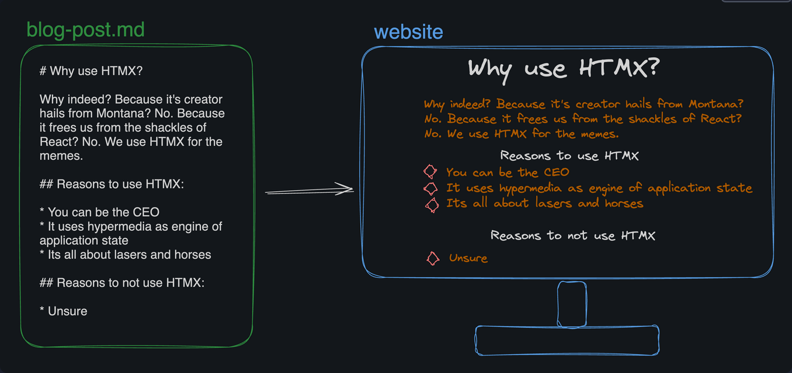

# Static-Site-Generator
A static site generator takes raw content files (like Markdown and images) and turns them into a static website (a mix of HTML and CSS files).

## How it work


## Generate
- Put your mardown in ```content``` folder
- Run the script ```./main.sh``` in the root directory to generate pages and start simple web server.

If everything goes well, you should able to see webpage at ```http://localhost:8888``` in your browser
